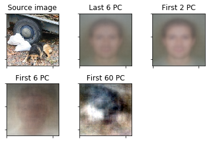
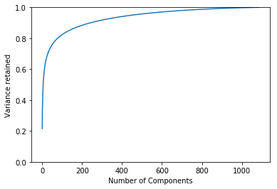
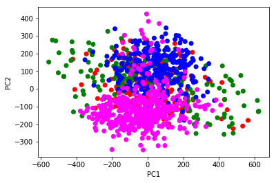
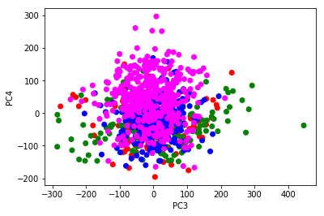
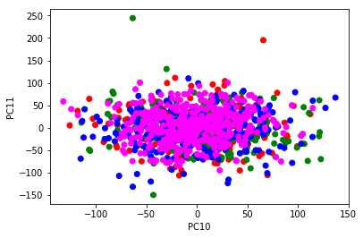
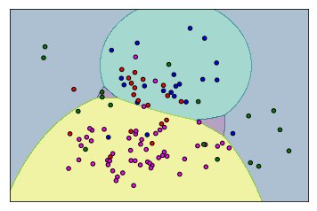

# <center> Artificial Intelligence and Machine Learning </center>

## <center> Homework 1: Principal Components Analysis </center>


#### <center> Student: </center>
#### <center> Jeanpierre Francois S243920 </center>


### Description

In this homework I had the pleasure to get a first taste of the PCA world using python.

The homework was split in different steps:
1. Data preparation
2. Principal component visualization
3. Classification

There were also some specific [questions](#questions) about certain crucial points.

### Code index
[Code Setup and functions definition](#definitions)

[Image's reduction and reprojection](#reprojection)

[Variance coverage](#VarianceCoverage)

[Scatter plots](#scatter)

[Classifier results](#classifier)

[Decision boundaries](#boundaries)

### Data preparation
The provided data, a subset of the PACS dataset, is a collection of images separated in 4 different folders which represented their classes: dogs, houses, guitars and people's faces.
The images, a total of 1087 samples with a dimension of (227,227,3) (colored images), had to be loaded into a variable "x" as a matrix of Nx(227x227x3) where N stands for the number of the samples.

### Principal component visualization
Once the data got loaded and converted in the chosen format I started working with the sklearn's PCA library, changing the base of the images, projecting them on the chosen components, doing inverse transformations and plotting them.
Put simply I had to exploit how to extract a certain number of components to form a new base where the images had to be projected.
The PCA library gets linear dimensionality reduction using Singular Value Decomposition (SVD) of the data in order to project it to a lower dimensional space.
It was a good exercise to project the images on various bases such as those formed on the first 60/6/2 pc and the last 6 ones and then [reproject](#reprojection) their reduced form in comparison, the results weren't visually satisfying but with just 60 of components the images were almost recognisable even without a lot of data.
A better visual result may be obtained using PCA(.98), doing so we select the minimum set of the first components needed to cover 98% of the total variance.
As the library says in sklearn's PCA the components are sorted by explained variance, the bigger the better, so the first components are the most important to represent the data. This can be observed looking at the [variance coverage](#VarianceCoverage) plot.
First components extracted from PCA are also important to distinguish classes from each other, as displayed from the [scatter plots](#scatter) the first two components embody a lot of informations and classes are quite distinguishable between each other, this distinction is less and lesser visible with the subsequent components in which they seem more and more overlapping each other.

### Classification
For classification I implemented the Naïve Bayes classifier from sklearn, splitting the dataset in a training and a testing set with all the components, with the data projected on the first two components and on the third and fourth ones. As I could imagine, the classification [results](#classifier) were higher with all the components and decreasing when using data projected on components that cover less and lesser variance.


### Questions <a id='questions'></a>

***1.2.4***
**Q** :
    Visualize X t using scatter-plot with different colors standing for different classes:
    import matplotlib.pyplot as plt plt.scatter(X t[:,0],X t[:,1],c=y)
    Repeat this exercise when considering third and fourth principal component, and then tenth
    and eleventh. What do you notice? Justify your answer from theoretical perspective behind
    PCA.

**A**: Looking at the [scatter plots](#scatter) we can see directly how in the first case, with the first two principal components, elements of different classes appear altogether separated from each other. In the subsequent plots the classes become more and more overlapped. This is because in principal component analysis the components are sorted by their explained variance, the [variance coverage](#VarianceCoverage) that the first ones provide is higher.  Therefore the first components carry more information then the subsequent ones and so the data is described better.

***1.2.5***
**Q** :
    How would you decide on the number of principal components needed to preserve data without
much distortion?

**A**:
    I would start looking at the [variance coverage](#VarianceCoverage) plot where I can deduct how many components I need to obtain a satisfying variance coverage. If I have a target distortion limit I can use directly the PCA library putting inside the PCA() brackets the desired percetage instead of the number of pc to use (Eg. PCA(.98)), this command will tell sklearn to choose the minimum number of principal components such that 98% of the variance is retained so it will select the first N components to reach that coverage.

***1.3.4***
**Q**:
    Train and test Naïve Bayes classier with Gaussian class-conditional distribution. You can use GaussianNB from package from sklearn.naive bayes for this purpose. Repeat the splitting, training, and testing for the data projected onto rst two principal components, then third and fourth principal components. Compare results: what are your conclusions?

**A**: Using the naïve bayes [classifier](#classifier) I obtained an accuracy score of 74% when all the components are considered, if I choose less components to represent the data the score can only decrement. The score obtained working only with the first 2 components is around 47%, 40% with the third and fourth. That is because the less information we use to classify the worst the score will be. As noted before the components in PCA are sorted and the first ones carry more information then the subsequent ones. Therefore if I use all the data I can obtain a good classification but if I decrease the information at classifier disposal, using less and lesser components, it will make more and more mistakes.


<a id='definitions'>Setup & functions</a>


```python
from PIL import Image
import numpy as np
import os
from sklearn.decomposition import PCA
import matplotlib.pyplot as plt
from sklearn.model_selection import train_test_split
from sklearn.naive_bayes import GaussianNB
from sklearn.metrics import accuracy_score
import sklearn.preprocessing as prepro
from matplotlib import gridspec

import warnings
warnings.filterwarnings("ignore")

# Constants
WIDTH = 227
HEIGHT = 227
#nSamples = 189

slash = "\\"
path = "C:\\PACS_homework"

sampleSize = 3*WIDTH*HEIGHT
labels = ["dog", "guitar", "house","person"]
label_color = {'dog': 'red', 'guitar': 'green', 'house': 'blue', 'person': 'magenta'}

#Functions
def importImages(flag):
        i = 0
        j = 0
        y = []
        tmp = []
        if flag == 'all':
                for dir in os.listdir(path):
                        localPath = path+ slash + dir
                        if os.path.isdir(localPath):
                                for file in os.listdir(localPath):
                                        if file.endswith(".jpg"):
                                                img_data = np.asarray(Image.open(localPath + slash + file))
                                                tmp.append(img_data.ravel())
                                                y.append(j)
                                                i = i + 1
                                j = j + 1
        else:
                localPath = path + slash + flag
                if os.path.isdir(localPath):
                        for file in os.listdir(localPath):
                                if file.endswith(".jpg"):
                                        img_data = np.asarray(Image.open(localPath + slash + file))
                                        tmp.append(img_data.ravel())
                                        y.append(j)
                                        i = i + 1
                        j = j + 1

        return np.array(tmp), y

def showColorClasses(input_matrix):
        cvec = []
        scaled = prepro.StandardScaler().fit_transform(input_matrix)
        x_t = PCA(2).fit_transform(scaled)
        cvec = [label_color[labels[k]] for k in y]
        plt.scatter(x_t[:,0],x_t[:,1],c=cvec)
        plt.xlabel("PC1")
        plt.ylabel("PC2")
        plt.show()

        pca_tot = PCA()
        pca_tot = pca_tot.fit(scaled)
        components3_4 = pca_tot.components_[3:5]
        components10_11 = pca_tot.components_[10:12]

        pca_tot.components_ = components3_4
        x_3_4 = pca_tot.transform(scaled)
        plt.scatter(x_3_4[:,0],x_3_4[:,1],c=cvec)
        plt.xlabel("PC3")
        plt.ylabel("PC4")
        plt.show()

        pca_tot.components_ = components10_11
        x_10_11 = pca_tot.transform(scaled)
        plt.scatter(x_10_11[:,0],x_10_11[:,1],c=cvec)
        plt.xlabel("PC10")
        plt.ylabel("PC11")
        plt.show()

def showImageWithPca(n_pca, input_matrix, nImg, show):
        pca_x = PCA(n_pca)
        scaler = prepro.StandardScaler()
        scaled = scaler.fit_transform(input_matrix)
        projected = pca_x.fit_transform(scaled)
        x_inv = pca_x.inverse_transform(projected)
        x_inv = scaler.inverse_transform(x_inv)
        #print variance ratio
        val = np.sum(pca_x.explained_variance_ratio_)
        print('Variance covered: '+ str(val)) #variance covered with this pca
        if (show):
                fig = plt.figure()
                fig.add_subplot(1,2,1)
                plt.imshow(np.reshape(input_matrix[nImg,:]/255.0,(227,227,3)))
                fig.add_subplot(1,2,2)
                plt.imshow(np.reshape(x_inv[nImg,:]/255.0,(227,227,3)))
                plt.show()
        else:
                return x_inv[nImg,:]

def showImageWithPcaLast(n_pca, input_matrix, nImg, show):
        #PCA last n computation
        pca_last_n = PCA()
        scaler = prepro.StandardScaler()
        scaled = scaler.fit_transform(input_matrix)
        pca_last_n = pca_last_n.fit(scaled)
        components = pca_last_n.components_[-n_pca:]
        pca_last_n.components_ = components
        x_last_n = pca_last_n.transform(scaled)
        x_inv_last_n = pca_last_n.inverse_transform(x_last_n)
        x_inv_last_n = scaler.inverse_transform(x_inv_last_n)
        #print variance ratio
        val = np.sum(pca_last_n.explained_variance_ratio_)
        print('Variance covered: '+ str(val)) #variance covered with this pca

        if(show):
                fig_last_n = plt.figure()
                fig_last_n.add_subplot(1,2,1)
                plt.imshow(np.reshape(input_matrix[nImg,:]/255.0,(227,227,3)))
                fig_last_n.add_subplot(1,2,2)
                plt.imshow(np.reshape(x_inv_last_n[nImg,:]/255.0, (227,227,3)))
                plt.show()
        else:
                return x_inv_last_n[nImg,:]

def showVarCovederageRateoWithPCA(n_pca, input_matrix):
        #number of components over variance coverage
        if n_pca>=0:
                pca_x = PCA(n_pca).fit(input_matrix)
                #print(str(round(np.cumsum(pca_x.explained_variance_ratio_),2)))
                plt.xticks(np.arange(n_pca),np.arange(1,n_pca+1))
        else:
                pca_x = PCA().fit(input_matrix)
        plt.plot(np.cumsum(pca_x.explained_variance_ratio_))
        plt.xlabel('Number of Components')
        plt.ylabel('Variance retained')
        plt.ylim(0,1)
        plt.show()

def naiveBayesClassifier(input_matrix, classes, firstPC=0, lastPC=0):
        scaled = prepro.StandardScaler().fit_transform(input_matrix)
        if firstPC == 0 and lastPC == 0:
                x_train, x_test, y_train, y_test = train_test_split(scaled, classes, test_size=0.1)
        else:
                #Select only PCA in range
                pca_tot = PCA()
                pca_tot = pca_tot.fit(scaled)
                twoComponents = pca_tot.components_[firstPC:lastPC]
                pca_tot.components_ = twoComponents
                x = pca_tot.transform(scaled)   
                #Train and use the model
                x_train, x_test, y_train, y_test = train_test_split(x, classes, test_size=0.1)

        clf = GaussianNB()
        clf.fit(x_train,y_train)
        prediction = clf.predict(x_test)
        accuracy = accuracy_score(y_test,prediction)
        print('Accuracy score: '+str(accuracy))

def plotClfBoundaries(input_matrix,classes):
        cvec = []
        step = 20
        projected = PCA(2).fit_transform(input_matrix)

        x = projected[:,[0,1]]

        x_train, x_test, y_train, y_test = train_test_split(projected, classes, test_size=0.1)
        cvec = [label_color[labels[k]] for k in y_test]

        clf = GaussianNB()
        clf.fit(x_train,y_train)
        # Plotting decision regions
        x_min, x_max = x_train[:, 0].min() - 1, x_train[:, 0].max() + 1
        y_min, y_max = x_train[:, 1].min() - 1, x_train[:, 1].max() + 1
        xx, yy = np.meshgrid(np.arange(x_min, x_max, step),
                        np.arange(y_min, y_max, step))

        Z = clf.predict(np.c_[xx.ravel(), yy.ravel()])
        Z = Z.reshape(xx.shape)
        plt.contourf(xx, yy, Z, alpha=0.4)
        plt.scatter(x_test[:, 0], x_test[:, 1], c=cvec, s=20, edgecolor='k')
        plt.xticks([])
        plt.yticks([])
        plt.show()
```


```python
# Inizializzazioni
x, y = importImages('all')
nImg = 10
```

<a id='reprojection'>PCA re-projection 1.2.3</a>


```python
figure = plt.figure()
plt.subplots_adjust(hspace = 0.2, wspace = 0.4)
ax = figure.add_subplot(2, 3, 1)
ax.set_title('Source image')
ax.set_xticklabels([])
ax.set_yticklabels([])
plt.imshow(np.reshape(x[nImg,:]/255.0,(227,227,3)))
ax = figure.add_subplot(2, 3, 2)
ax.set_title('Last 6 PC')
ax.set_xticklabels([])
ax.set_yticklabels([])  
plt.imshow(np.reshape(showImageWithPcaLast(6, x, nImg, False)/255.0,(227,227,3)))
ax = figure.add_subplot(2, 3, 3)
ax.set_title('First 2 PC')
ax.set_xticklabels([])
ax.set_yticklabels([])
plt.imshow(np.reshape(showImageWithPca(2, x, nImg, False)/255.0,(227,227,3)))
ax = figure.add_subplot(2, 3, 4)
ax.set_title('First 6 PC')
ax.set_xticklabels([])
ax.set_yticklabels([])
plt.imshow(np.reshape(showImageWithPca(6, x, nImg, False)/255.0,(227,227,3)))
ax = figure.add_subplot(2, 3, 5)
ax.set_title('First 60 PC')
ax.set_xticklabels([])
ax.set_yticklabels([])
plt.imshow(np.reshape(showImageWithPca(60, x, nImg, False)/255.0,(227,227,3)))
plt.show()
```

    Variance covered: 1.0
    Variance covered: 0.337544820241
    Variance covered: 0.501120392647
    Variance covered: 0.768988299613


    Clipping input data to the valid range for imshow with RGB data ([0..1] for floats or [0..255] for integers).





<a id='VarianceCoverage'>Variance coverage</a>


```python
showVarCovederageRateoWithPCA(-1,x) #first parameter to select the first n pc, -1 for all components
```





<a id='scatter'>Scatter plots 1.2.4</a>


```python
showColorClasses(x)
```











<a id='classifier'>Classifier 1.3</a>


```python
naiveBayesClassifier(x,y) #It's possible to insert a principal components range (es: (x,y,0,1) from pc 0 to pc 1)
```

    Accuracy score: 0.743119266055


```python
naiveBayesClassifier(x,y,0,1) #first 2 components
```

    Accuracy score: 0.467889908257


```python
naiveBayesClassifier(x,y,2,3) #with third and fourth components
```

    Accuracy score: 0.403669724771


<a id='boundaries'>Boundaries 1.3.5</a>


```python
plotClfBoundaries(x,y) #decision boundaries on the first two components
```



